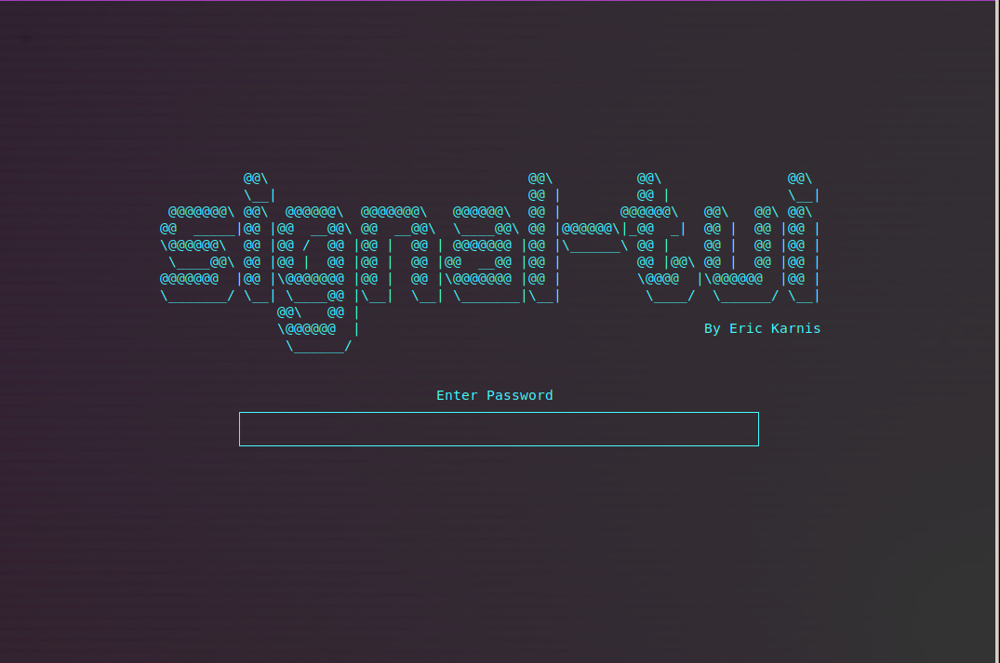

# Signal TUI

A textual user interface for signal using signal-cli


# Dependencies

signal-tui relies on the following things:

- [signal-cli](https://github.com/AsamK/signal-cli), with the dbus service enabled!
- ncurses, which can be installed on ubuntu/debian with this:
	```sh
sudo apt install libncurses5-dev libncursesw5-dev
	```
- passlib, which can be installed with `python3 -m pip install passlib`
- qrcodegen, which can be installed with `python3 -m pip install qrcodegen`


# How to run

signal-tui can be started/used by running the `signal-tui.py` file: `python3 signal-tui.py`

Or make the file executable and run it:
```sh
chmod u+x signal-tui.py
./signal-tui.py
```


# Screenshot



